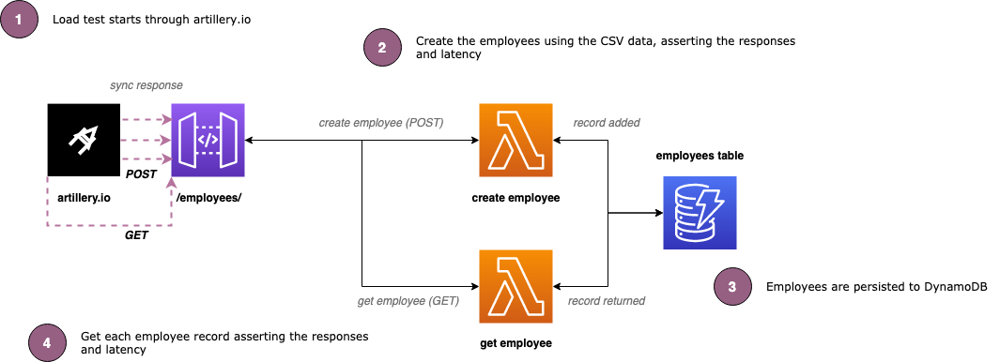

# serverless-load-testing-artillery

## Introduction

Example load testing serverless apps using Artillery.io against the following architecture which is discussed in the following [blog post](/):

> This is a minimal set of code to demonstrate the use and configuration of artillery, so coding and architecture best practices have not been adhered too (inc unit testing)

## Getting started

**Note: This will incur costs in your AWS account on running the load tests which you should account for.**

To get the project up and running, in the root of the folder run `npm i` which will install all of the dependencies.

## Deploying the services

To deploy the services run the following command in the root folder: `npm run deploy:develop` (_or equivelant for the environment your working with_)

## Running the load tests

To run the load tests, ensure that the services have been deployed, and running the following commands per environment:: `npm run test:load:develop`.

This runs the following npm scripts which generates the output, and the post script runs the generation of the report:

`$(npm bin)/artillery run --output ./tests/data/results/develop.json -e develop ./tests/load.yml`

and

`$(npm bin)/artillery report --output ./tests/data/reports/load/report-load-develop-\"$(date \"+%Y-%m-%d_%H-%M-%S\")\".html ./tests/data/results/develop.json`

The post NPM script generates a report with an example name of: `report-load-develop-2021-07-28_20-27-07.html`

## Running the smoke tests

To run the smoke tests, run the `npm run test:smoke:develop`, which will produce the following report example output: `report-smoke-develop-2021-07-28_20-26-37.html`

## Running the functional/fuzz tests

To run the smoke tests, run the `npm run test:func:develop`, which will produce the following report example output: `report-func-develop-2021-07-28_20-25-04.txt`

## Reporting

Once you have ran the load tests you can view the HTML report output in the `reports` folder, for example: `report-qa-2021-07-22_21-31-37.html`

For a fancier report you can upload the output JSON to the following webpage: [https://reportviewer.artillery.io/](https://reportviewer.artillery.io/)
